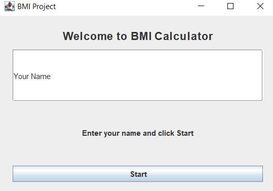
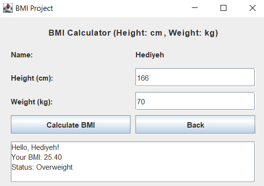

# BMI Calculator - Java Swing

This project is a simple BMI (Body Mass Index) calculator developed using **Java Swing**.

## Project Description
The application consists of two graphical pages:
1. A welcome page where the user enters their name.
2. A BMI calculator page where the user enters height (cm) and weight (kg) and receives:
   - BMI value
   - Body status (Underweight, Normal, Overweight, Obese)

This project was implemented according to the requirements of Workshop 11 (Advanced Programming).

## Technologies Used
- Java
- Java Swing (JFrame, JPanel, JButton, JTextField, JTextArea)

## Screenshots

### Welcome Page


### Calculator Page


## How to Run
```bash
java BMIApp.java
